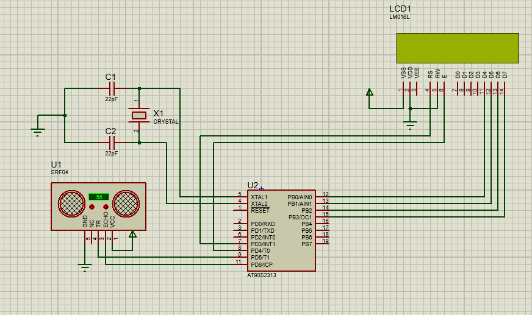

# ultasonic-Distance-Meter-AVR
embedded system built on AVR Architecture To measure Distance by ultasonic Distance Sensor and Display Distance on LCD character display.

## Circuit

## Features
- using Timer1 Capture unit To measure Distance precisely.
- using My 4-bit LCD character display Library.
- built using Open source software development tools(AVR-GCC). 
## Build
run AVR.bat file to build project.
